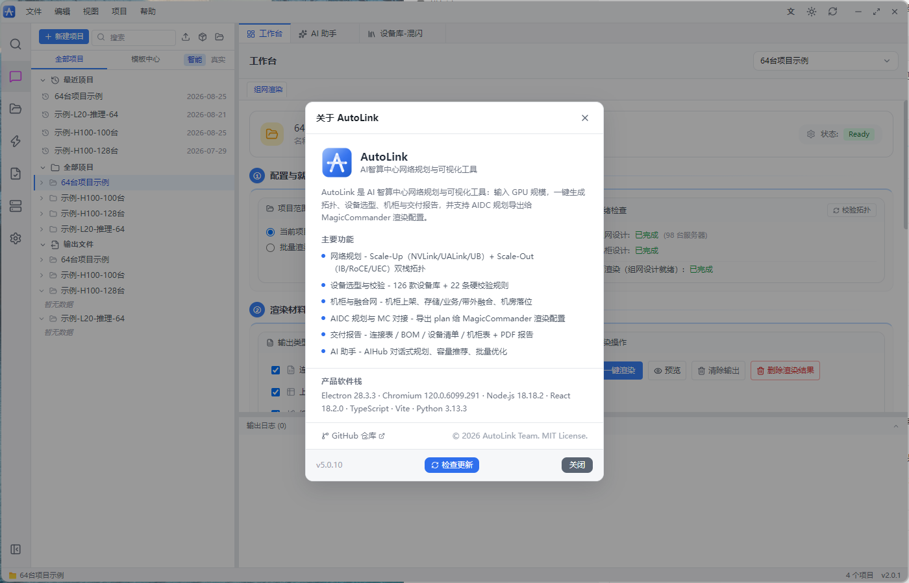
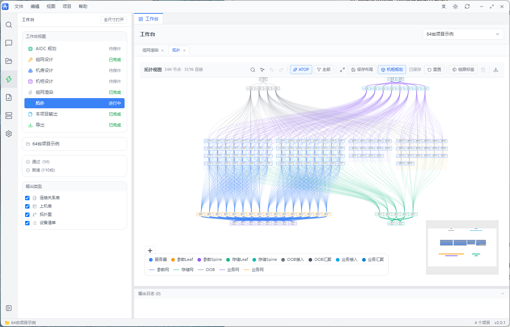
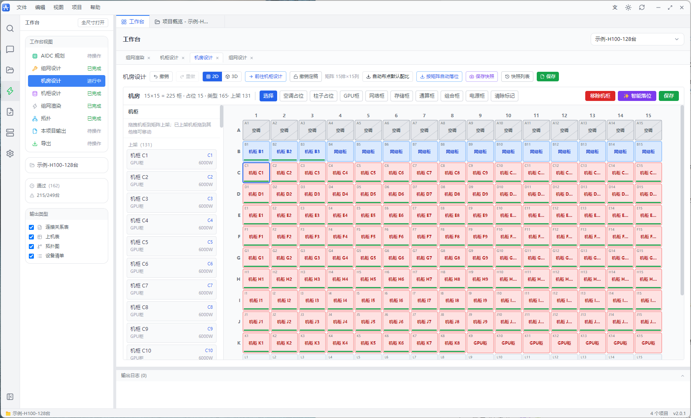
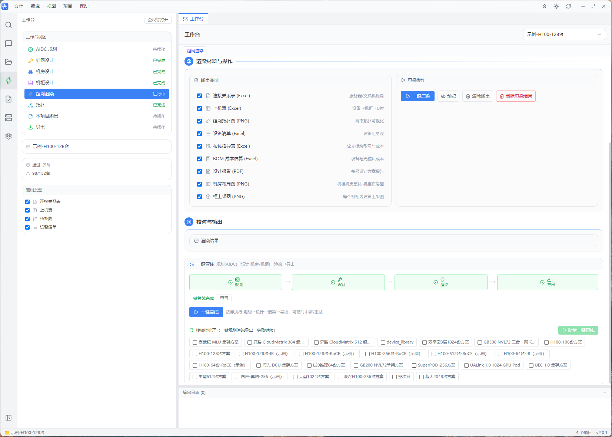
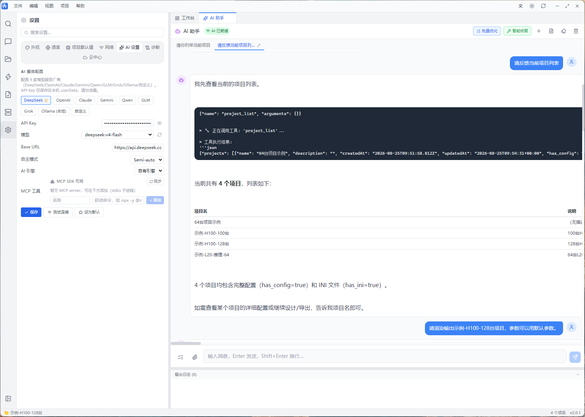

<div align="center">

# AIDC AutoLink

**AI 智算中心网络规划与可视化工具 | AI Data Center Network Planning, Topology Design & Visualization**

*面向 AI 数据中心 / 智算中心 / GPU 集群的网络架构设计、拓扑生成、设备选型、机柜规划与交付报告一体化平台*

[](https://github.com/bangbang8000-cell/AutoLink/releases)
[](LICENSE)
[](#)
[](#)
[](#)
[](#)
[](#)
[](#)

</div>

---

**AIDC AutoLink** 是一款专为 **AI 数据中心（AIDC）** 设计的**网络规划与可视化工具**：从 GPU 集群 **Scale-Up 双栈拓扑**（NVLink / UALink / UB）到 Scale-Out 网络架构（Fat-Tree / Rail-Optimized / UEC），从**设备选型**到**机柜上架**，从 **PUE 能耗估算**到 **PDF/Excel 交付报告**，全流程一站完成。输入服务器规模，一键生成可交付的智算中心网络设计方案。

> 🚀 典型场景：**1024 GPU 训练集群** / **NVL72 单架域** / **华为 CloudMatrix 384** / **昇腾超节点** / **大模型推理集群** —— 从模板到完整交付报告仅需数分钟。

---

## ✨ 为什么选择 AIDC AutoLink

| 维度 | 能力 |
|------|------|
| **全栈规划** | Scale-Up（卡间互联）+ Scale-Out（网间互联）双栈一体化，支持 IB / RoCE / UEC 三种 Scale-Out 协议 |
| **真材实料** | **127 款**设备库 = **92 款硬件**（NVIDIA / 华为 / H3C / 锐捷 / 浪潮 / 寒武纪 / 海光）+ **35 款光模块** |
| **硬核校验** | **21 条**校验规则（V001–V020、V022；**V021 缺号**）：拓扑连通性、端口容量、光模块匹配、功率上限、三合一融合域，杜绝"设计失守" |
| **交付级报告** | 连接表 / 布线表 / BOM / 设备清单 / 机柜表 / 9 章 PDF 报告，收敛比全部按计算值输出 |
| **开箱即用** | **23 套**场景模板（含 7 套 H100/昇腾示例）+ 5 种语言 + 自动更新，Windows / macOS / Linux 三平台 |

---

## 🚀 三步完成智算中心网络规划

```
1️⃣ 选择模板或新建项目 → 配置规模参数与设备选型（向导分步校验，错误即时提示）
2️⃣ 一键生成拓扑 → 查看拓扑图 / PUE / 收敛比 / Scale-Up 域规划 / 校验结果
3️⃣ 渲染交付 → 输出连接表、布线表、BOM、设备清单、机柜表、PDF 报告
```



---

## 🧩 核心能力

### 🏗️ 智算网络设计

GPU 卡间互联（Scale-Up）与服务器间网络（Scale-Out）双栈一体化规划：

- **Scale-Up**：NVLink（NVL72）、UALink 1.0（1024 GPU Pod）、UB（CloudMatrix 384）三种卡间互联协议，域内 GPU 全对等边自动生成
- **Scale-Out**：Fat-Tree 胖树 / Rail-Optimized / ZCube / 双平面（dual-plane）/ 三合一融合网 / 华为超节点，支持 IB / RoCE / UEC 协议
- **超大规模**：Edge 裁剪 + 折叠归一化，2048 台全量交付无失真；1 分 2 扇出（breakout）自动辨识
- **开放配置**：统一 schema 版本化配置模型 + 场景预设 + 导入导出

### 📐 交互式可视化

- **拓扑视图**：分层 × 分区 × 分组自动布局，框选拖动 / 对齐工具栏 / 链路悬浮高亮 / 布局落盘
- **机房矩阵**：行×列自定义矩阵（如 225 柜），占位标记 + 拖拽落位 + 即时校验
- **机柜视图**：42U/49U 可视化，多约束自动装箱（功率 / U 位 / 散热），功率 3 级色码监控
- **机房 3D**：react-three-fiber 全景 + 冷热通道 + 热力着色 + 2D↔3D 联动 + PNG 导出





### ✅ 硬核校验与智能优化

- **21 条校验规则（V001–V020、V022，V021 缺号）**：拓扑连通性、端口容量、光模块匹配（含分裂线缆）、功率上限、ZCube/超节点/三合一融合域专项校验
- **PUE 与能耗**：风冷 / 冷板液冷 / 浸没式三种散热，参数化重算，达标判断（<1.25）
- **收敛比校验**：参数网 1:1 / 存储网 1:1~2:1 / 业务网 3:1~4:1，报告读取计算值
- **光模块智能选型**：35 款库（100G~1.6T），按速率/距离/缆型自动选型 + 成本估算
- **批量优化**：收敛比 / 成本 / 散热建议批量生成并应用
- **智能修复**：校验错误（rule_id 级）→ 修复 patch 预览 → 一键应用 → 复核闭环
- **机房智能落位**：约束满足 + 多目标优化（功率均衡/散热分区/网络就近/布线最短），可对话驱动



### 🤖 AI 智能体（AIHUB）

- **对话式管理**：设备/模板/项目对话查询，自然语言 → 项目配置预览 → 确认落盘
- **9 大模型 Provider** + **72 个 Agent 工具** + 工具权限分级（AUTO/NOTIFY/CONFIRM）+ MCP 工具接入 + 多步自主任务编排
- **容量规划**：17 模型档案（含 5 国产场景）→ 通信量估算 → 拓扑推荐 + TCO 成本
- **ATOP 拓扑优化**：模型通信特征 → ZCube 2D/3D cube 推荐，一键应用到画布
- **知识库**：KnowledgeEngine 检索式召回，AI 对话自动注入上下文



### 📦 专业交付导出

- **Excel**：连接表 / 布线指导表（含光模块型号与成本）/ BOM（按型号聚合）/ 设备清单 / 机柜表
- **PDF 报告**：9 章节（概览/架构/功耗/光模块/成本/校验/设备清单/收敛比/机柜），2048 台全量无失真
- **评审包**：设计报告 PDF / 合规 / 布线 / BOM / 评审 PDF / 评审包 / MC 交付包一键生成

### ☁️ 协作与生态

- **扫码登录**：飞书 / QQ / 微信三通道，JWT 会话 + 凭据安全保管
- **云中心**：云端项目与模板 / 项目同步（六态 SHA 比对）/ 全局搜索（本地 + 云端）
- **分享与模板市场**：只读方案快照分享（免登录预览页）+ 模板市场（评分/订阅/收藏/权限管理）+ ZIP 加密
- **设备库云同步**：拉取合并 / 发布 bundle，跨端资产互灌

### 🛡️ 质量、安全与体验

- **纵深安全**：sandbox + CSP（渲染层零网络/零 Node）+ IPC zod 运行时校验 + 日志脱敏
- **崩溃可回收**：本地崩溃转储 + 渲染进程崩溃自动恢复
- **质量门禁**：前端 Vitest（114 文件 / 1431 用例）+ 后端 pytest（86 文件 / 1613 用例）+ E2E + 覆盖率棘轮只升不降 + golden/模板校验 + 文档数字真值校验
- **品牌主题**：4 色品牌主题一键切换，设计 token 驱动全端
- **国际化**：5 种语言，i18n key 完整性测试防回归

---

## 📈 版本演进

与 MagicCommander 双端三位一体推进，AutoLink 历经 3.x（引擎与组网基础）、4.0 系列（工程基座 / AI 底座 / 协作 / 3D / 性能 / 质量 / 交付 / 示例）、5.0 系列（AI 工作流 / 协作生态 / 3D / 性能 / 质量 / 交付 / 内容收官）、5.1 系列（Agent Connect：MCP Server 双场景互联）——每版独立可运行、可发布、可回滚，门禁只升不降。

- **4.0 系列**（v4.0.0–v4.9.0）：工程基座与 CI 门禁、AI 项目/模板操作工具、一致性校验引擎、质量仪表盘、诊断中心、项目包往返、AIDC 四示例收官
- **5.0 系列**（v5.0.1–v5.0.10）：统一 AgentProvider + AI 引擎三选一、多步任务编排、技能自学习、MCP 工具接入、模板市场生态、知识库与文档工作台、机房 3D、拓扑视口渲染优化、lint 清零、升级体验（断点续传/SHA-512/回滚/灰度）、示例库扩充至 7 个 + 模板 23 套全量重测
- **5.1 系列**（v5.1.0–v5.1.9）：**Agent Connect**（把 AutoLink 封装为标准 MCP Server，编译态受限 / 源码态无限制双场景）、确定性语义层、异步长任务（task_submit/query/wait/cancel）、操作审计（audit_query 脱敏）、远程模式试点、Agent 反馈自优化、自检与排错
- **5.2 系列**（v5.2.0–v5.2.5）：工作台精细打磨与回归发布（5.2 首版）；**5.2.2 修复版**——双端契约面同构（`test_dual_end_parity_522`）、Agent Connect 权限门禁真实化（gate_mode/block_audit/启动断言）、导出产物指纹复用 + `--no-archive` + 缺省全类型、`schema_version` + 英文规范子树（`data` / `legacy_data` 过渡双子树）、CLI 退出码契约（0/1/2/3）、文档数字自动校验门禁；**5.2.3 修复版**——连接去重键方向不敏感缺陷（E005/E011，误删双向连接）、CI 红灯清零（mcp 依赖上限 / 挂死用例超时护栏 / 旧契约断言对齐）、机柜台数文案与手册更正（每柜 GPU **服务器台数**、功率默认 12000W、一柜多台需两处同设）；**5.2.4 修复版**——收敛比建议改用配置意图值（恢复 V5.0.11 下联钳制下不可达的收敛比建议）、单柜功率上限默认值全链路统一为 12000W（代码向用户手册既有真值对齐）；**5.2.5 修复版（R0 止血）**——**光模块选型系统性误配**：两个独立根因（`_parse_speed('1.6T')` 被解析为 **1**、降级分支忽略速率）导致 1.6T 模块被 1G 网线链路选中、25G 链路被装 100G/400G 模块，污染模块总数与成本；修复后**跨速率误配清零**，`reportData` 新增 `module_selection` 三分类守恒台账（**纯增量、不 bump `schema_version`**），`cost` 增加 `可用于报价=false` 口径标注，布线表/BOM 同步显式化未匹配链路，并更正 5.2.2 的四项过度宣称

---

## 📦 快速开始

### 方式一：下载安装包（推荐）

前往 [Releases](https://github.com/bangbang8000-cell/AutoLink/releases) 下载对应平台安装包：

- **Windows**：`AutoLink-Setup-5.2.5-win.exe`（NSIS 安装包）
- **macOS**：`AutoLink-5.2.5-mac-x64.dmg` / `AutoLink-5.2.5-mac-arm64.dmg`
- **Linux**：`AutoLink-5.2.5-linux.AppImage` / `.deb`

安装后首次启动自动创建示例项目，内置 **23 套场景模板**（含 7 套 H100/昇腾示例）与 **127 款设备库**（92 硬件 + 35 光模块）。

### 方式二：从源码运行

#### 环境要求
- **Node.js** ≥ 22
- **Python** ≥ 3.12（推荐；需 `pandas`、`openpyxl`、`reportlab`）

```bash
git clone https://github.com/bangbang8000-cell/AutoLink.git
cd AutoLink
npm install
pip install -r backend/requirements.txt
npm run dev:all
```

### 打包构建

```bash
npm run dist:win    # Windows (NSIS .exe)
npm run dist:mac    # macOS (DMG x64 + arm64)
npm run dist:linux  # Linux (AppImage + DEB)
```

> V3.0.0 起：`electron-builder` 前自动用 **PyInstaller** 将 Python 引擎打包为免 Python 运行的后端（`scripts/pyinstaller.spec`），安装包内置 `backend-dist`。

### 运行测试

```bash
npm test              # 前端测试（Vitest 114 文件 / 1431 用例）
npm run test:backend  # 后端测试（pytest 86 文件 / 1613 用例）
npm run test:all      # 全量测试（含 e2e）
npm run typecheck     # TypeScript 类型检查（含 preload）
npm run lint          # ESLint 代码检查（0 error 0 warning）
python scripts/validate_templates.py  # 23 套模板验证
python scripts/gen_golden.py --check  # golden 基线比对
python scripts/check_doc_numbers.py   # 文档数字真值校验
```

---

## 🗂️ 内置模板（23 套）

| 模板 | 场景 | 规模 | Scale-Up |
|------|------|------|----------|
| NVL72-单架 | NVIDIA GB200 NVLink 域 | 72 GPU | NVLink 72 单域 ✅ |
| **GB300-NVL72-三合一** | GB300 冷板液冷 + 三合一融合网 | 72 GPU | NVLink 72 单域 ✅ |
| ualink_1_0_1024 | UALink 1.0 1024 GPU Pod | 1024 GPU | UALink 1024 ✅ |
| uec_1_0_cluster | UEC 1.0 集群 | 1024 GPU | — |
| SuperPOD-256 | NVIDIA SuperPOD | 256 GPU | — |
| DP3Tier-1024 | 3-tier 双平面 800G | 1024 GPU | — |
| H100-100台 / H100-128台 | NVIDIA H100 训练 | 100 / 128 GPU | — |
| **H100-64台-IB / H100-64台-RoCE** | H100 示例（单 POD） | 64 GPU | — |
| **H100-128台-IB / H100-128台-RoCE** | H100 示例（双 POD） | 128 GPU | — |
| **H100-256台-RoCE** | H100 示例（四 POD 规模化） | 256 GPU | — |
| **H100-512台-RoCE** | H100 示例（超大规模） | 512 GPU | — |
| **国产-昇腾-256** | 华为昇腾 910C 国产智算 | 256 NPU | — |
| L20-推理-64 | L20 推理集群 | 64 GPU | — |
| cambricon_mlu_cluster | 寒武纪 MLU 集群 | — | — |
| hygon_dcu_cluster | 海光 DCU 集群 | — | — |
| 液冷-H100-256 | 液冷场景 | 256 GPU | — |
| 中型-512 / 大型-1024 / 超大-2048 | 训练集群 | 512 / 1024 / 2048 GPU | — |
| 空项目 | 从零开始 | — | — |

> 其中 7 套为示例项目（isSample=true）：H100-64台/128台/256台/512台 × IB/RoCE + 国产-昇腾-256，覆盖 64 台到 512 台完整规模谱系。

---

## 🛠️ 技术栈

- **前端**：React 18 + TypeScript + Zustand + Tailwind CSS + @xyflow/react + ECharts + Vite
- **桌面**：Electron + contextBridge（安全隔离）+ electron-updater（双通道更新）
- **后端**：Python（pandas + openpyxl + reportlab），JSON-RPC 子进程桥接，PyInstaller 免 Python 打包
- **AI Hub**：独立 FastAPI 进程（端口 18722）+ 9 Provider + 72 Agent Tools + MCP Client + MCP Server（Agent Connect）+ 知识库/技能/记忆
- **测试**：Vitest（114 文件 / 1431 用例）+ pytest（86 文件 / 1613 用例）+ E2E（Playwright）
- **i18n**：react-i18next（5 种语言）
- **CI/CD**：GitHub Actions 三平台矩阵构建（win / mac / linux）+ 模板/golden 门禁

---

## 📁 项目结构

```
AutoLink/
├── backend/                # Python 计算引擎
│   ├── facade.py           #   CLI 入口（JSON-RPC + 设计流程编排）
│   ├── engine.py           #   action 分发（design/validate/export/estimate/capacity/atop/optimize/repair/room）
│   ├── designer.py         #   网络设计协调层（四网 + 三合一融合网）
│   ├── dual_plane_topology.py # 双平面拓扑
│   ├── zcube_topology.py   #   ZCube 扁平二部图拓扑
│   ├── network_plugin.py   #   插件化接线（param/storage/biz/oob/scale_up/zcube）
│   ├── rail_topology.py    #   Rail-Optimized 拓扑算法
│   ├── rack_allocation.py  #   多约束机柜分配
│   ├── room_optimizer.py   #   机房智能落位（约束满足 + 多目标优化）
│   ├── validation.py       #   21 条校验规则引擎（V001–V020、V022；V021 缺号）
│   ├── optical_selector.py #   光模块智能选型（含 1 分 2 分裂线缆）
│   ├── exporter.py         #   Excel/PDF 导出
│   ├── device_library.py   #   设备库加载器（127 款 = 92 硬件 + 35 光模块）
│   ├── optimization.py     #   批量优化（收敛比/成本/散热建议 + 应用）
│   ├── fixit.py            #   智能修复（校验错误 → 修复 patch → 复核闭环）
│   ├── atop/               #   ATOP 自动拓扑优化（特征解析 + ZCube 推荐）
│   ├── capacity_planning/  #   容量规划内核（档案/通信量/TCO/自定义档案）
│   └── autolink_hub/       #   AIHUB（Provider / 工具注册 / 技能 / 对话 Agent）
├── electron/               # Electron 主进程（IPC / 更新服务 / Python service）
├── src/                    # React 前端（ui 组件库 / stores / i18n）
├── template/               # 设备库（127 款 = 92 硬件 + 35 光模块）+ 23 套场景模板
├── scripts/                # pyinstaller.spec / validate_templates / gen_golden
├── docs/                   # 产品文档 / 用户指南 / PRD
└── tests/backend/          # Python 后端测试
```

---

## 📚 文档

| 文档 | 面向 | 说明 |
|------|------|------|
| [用户指南](docs/user_guide/user_guide.md) | 使用者 | 全功能操作手册（应用内「帮助 → 用户指南」可离线查看） |
| [MCP 接入指南](docs/user_guide/mcp_guide.md) | 使用者 | Agent Connect 接入外部 AI Agent 的配置样例 |
| [部署指南](docs/deployment.md) | 运维 / 开发者 | 环境准备、构建打包、生产部署、自动更新、故障排查 |
| [CLI 契约](docs/cli.md) | 集成方 | 命令行接口、退出码契约（0/1/2/3）、输出类型与归档策略 |
| [Agent Connect 样板](docs/agent-connect/README.md) | 集成方 | Claude Desktop / Codex / Trae / VS Code 的 MCP 配置 |
| [文档索引](docs/README.md) | 全员 | 文档体系地图与维护规约 |
| [更新日志](CHANGELOG.md) | 全员 | 逐版本变更明细 |
| [Wiki](https://github.com/bangbang8000-cell/AutoLink/wiki) | 全员 | 产品介绍与快速上手 |

> 文档中的数字（设备库 127 / 模板 23 / 校验规则 21）由 `scripts/check_doc_numbers.py` 以**代码为唯一真值源**反向校验，CI 门禁拦截漂移。

---

## 🚀 路线图

| 阶段 | 状态 | 核心交付 |
|------|------|---------|
| **4.0 系列** | ✅ 已完成 | 工程基座 / AI 底座 / 协作 / 3D / 性能 / 质量 / 交付 / 内容资产十版 |
| **5.0 系列** | ✅ 已完成 | AI 工作流 / 协作生态 / 3D / 性能 / 质量 / 交付 / 内容收官十版，双端三位一体 |
| **5.1 系列** | ✅ 已完成 | **AI Agent 互联**：Agent Connect（MCP Server 双场景：编译态受限 / 源码态无限制），让 Claude/Codex/Trae/VS Code 等外部 Agent 直接查询、创建、更新、渲染项目/模板/设备库/机房规划/输出 |
| **5.2 系列** | ✅ 已完成 | 工作台精细打磨回归发布（5.2.0）+ **5.2.2 修复版**：双端契约同构、Agent Connect 权限门禁真实化、导出产物指纹复用 / `--no-archive`、`schema_version` 与英文规范子树、文档数字自动校验门禁 + **5.2.3 修复版**：双向连接去重缺陷（E005/E011）、CI 红灯清零、机柜台数文案与手册更正 + **5.2.4 修复版**：收敛比建议恢复可达、单柜功率上限默认值统一为 12000W + **5.2.5 修复版（R0 止血）**：光模块选型跨速率误配清零（1.6T 误配 160→0）、`module_selection` 三分类守恒台账、`cost` 口径标注 |
| **后续方向** | 待定 | 远程模式正式化 + 多租户权限体系；模板市场社区化；CI/CD 流水线对接 |

---

## ❓ FAQ

**Q: AIDC AutoLink 支持哪些网络协议？**
A: Scale-Out 支持 IB、RoCE、UEC 三种；Scale-Up 支持 NVLink、UALink、UB 三种。可组合出 NVL72、CloudMatrix 384、UALink 1024 GPU Pod 等主流智算中心形态。

**Q: 支持多大的集群规模？**
A: 支持从 64 GPU 推理集群到 2048 台服务器的超大规模训练集群，内置 23 套模板（含 7 套 H100/昇腾示例，覆盖 64-512 台规模谱系）可直接使用，也可从空项目自定义。

**Q: 生成的报告包含哪些内容？**
A: 连接表、布线指导表、BOM 成本、设备清单、机柜表（Excel），以及 9 章节 PDF 报告（概览/架构/功耗/光模块/成本/校验/设备清单/收敛比/机柜），全部基于真实计算值。

**Q: 是否需要联网使用？**
A: 不需要。所有规划、计算、校验均在本地完成，离线可用；仅自动更新需要联网。

---

## 📄 License

[MIT](LICENSE) © AutoLink Team

---

*AIDC AutoLink —— 让每一座智算中心，都有据可依、开箱即达。*
